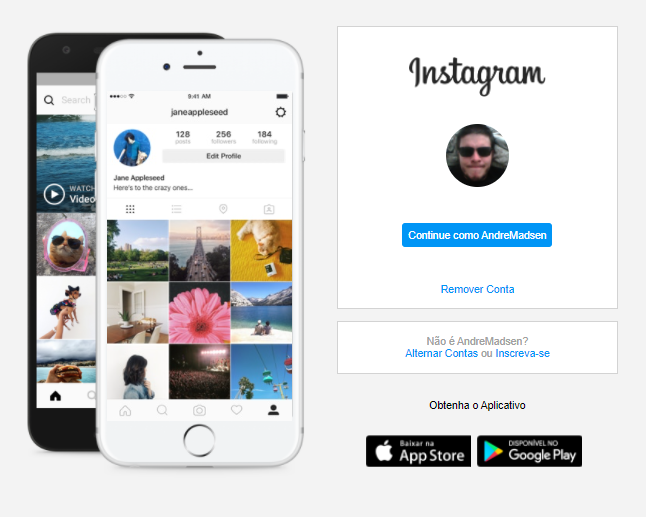

# Simple Instagram Login Page (HTML/CSS Only)
This project was made as part of Digital Innovation One's HTML Web bootcamp. 
The bootcamp project proposes creating an immitation of Instagram's login page layout to practice CSS positioning and responsiveness on html pages. 
Most of the CSS script follows the instructions given by the bootcamp instructor, with only a few modifications that I thought would bring the project closer to the original behavior found on instagram. 
The image files used were taken directly from instagram, or my own pc. 
I added a small JS file to rotate images on the cellphone background as is on the original site.
As in the bootcamp project, none of the actual functionalities are implemented, except the "appstore" buttons that had a functional href added.

### Things I've Learned on This Project: 

- Using 'REM' as a unit for sizing items in CSS.
- How to use nth-child on a CSS file to target a specific member of that class.

### Things I've Added to This Project:

- A simple JS file with a SetInterval function rotating images on the main page.
- Added a functional href to the "appstore" buttons. 

### How The Final Project Looks Like:

